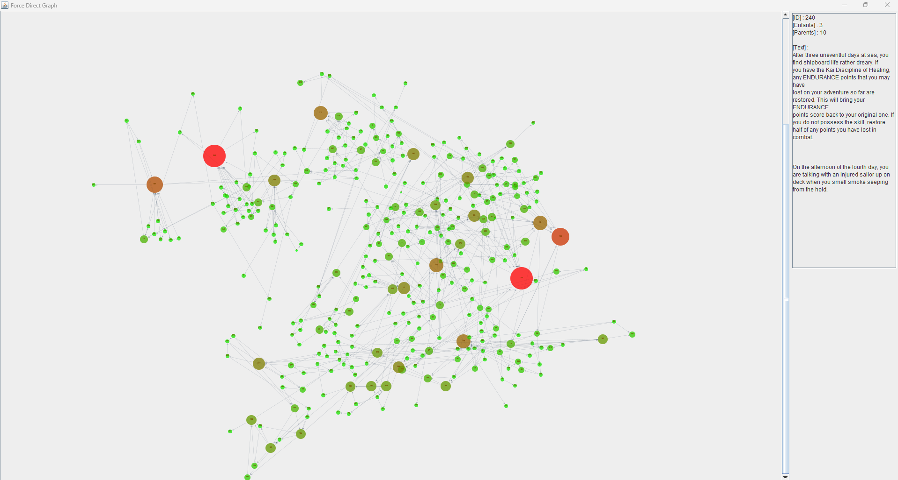

# Projet : Analyseur LDVEH

## Description

Projet de deuxième année de licence informatique.

## Les fonctionnalités

+ Dessin d'un graphe basé sur les forces (Force-Directed Graph)

+ Analyses d'un graphe (Parcours aléatoire, parcours plus cours chemin)

+ Modèle étendu (combats, items, hero et choix)

## Contribuer

+ N'hésitez pas à signaler des bugs

+ N'hésitez pas à améliorer le code existant

## Licence

Ce projet est sous licence [MIT](./LICENSE.md).

## Captures d'écran

